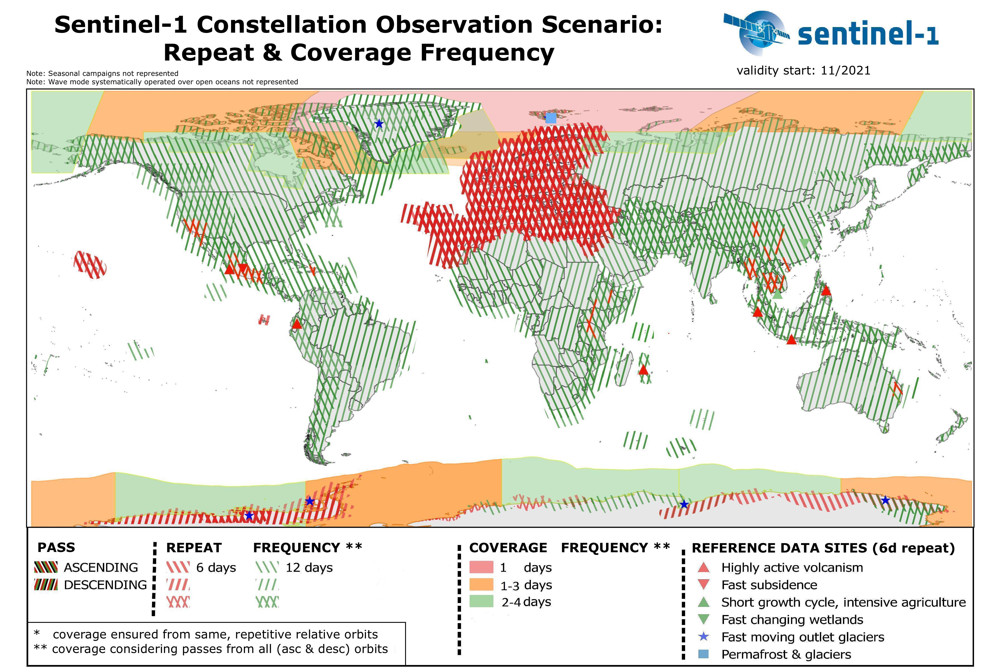

---
title: "Sentinel 1"
author: "Mike Hathorn"
institute: "CASA, UCL"
date: "2023/01/31 (updated: `r Sys.Date()`)"
output:
  xaringan::moon_reader:
    css: xaringan-themer.css
    lib_dir: libs
    nature:
      highlightStyle: github
      highlightLines: true
      countIncrementalSlides: false
---

```{r include=FALSE}
library(RefManageR)
library(knitcitations)
BibOptions(check.entries = FALSE,
           bib.style = "authoryear",
           cite.style = "authoryear",
           style = "markdown",
           hyperlink = TRUE,
           dashed = FALSE,
           no.print.fields=c("doi", "url", "urldate", "issn"))
myBib <- ReadBib("./CASA0023.bib", check = FALSE)

```


```{r xaringan-themer, include=FALSE, warning=FALSE}
library(xaringanthemer)
style_mono_accent(
  base_color = "#1c5253",
  header_font_google = google_font("Josefin Sans"),
  text_font_google   = google_font("Montserrat", "300", "300i"),
  code_font_google   = google_font("Fira Mono")
)
```


# Summary: Sentinel 1

.pull-left[* Two polar-orbiting satellites
* The only Sentinel mission to provide Synthetic Aperture Radar (SAR) imagery
* Allows for day and night imagery regardless of weather
* Focus (land) `r Citep(myBib, "esaLandMonitoringSentinel12022")``: 
  * Forest management
  * Agriculture monitoring
  * Urban deformation mapping
* Also used in marine monitoring and emergency management]

```{r echo=FALSE, out.width= "50%", fig.show='hold', fig.align= 'right', fig.cap= "Sentinel 1P (Source: European Space Agency, 2022)"}

knitr::include_graphics('images/Sentinel-1_pillars.jpg')
```
---

# Summary 2: Purpose

* Continuous radar mapping of Earth `r Citep(myBib, "esaSentinel1MissionObjectives2022")`
* Bi-weekly coverage of world's land masses, as well as sea-ice zones and Europe's coastal zones and shipping routes (daily)
* Expected mission duration: Minimum 7 years; fuel for 12 years 

```{r echo=FALSE, out.width= "70%", fig.show='hold', fig.align= 'center', fig.cap= "Sentinel 1P Coverage (Source: European Space Agency, 2022)"}


```

  

  


---

# Summary 3: SAR

* Sentinel 1 carries a single C-band SAR instrument
* Imagery produced using radio waves, not visible light - active sensor
* This allows the sensor to see through clouds (operates at a different point on the electromagnetic spectrum)


## Key attributes:

| **Resolution** |                                               |
| -------------- | --------------------------------------------- |
| Spatial        | As low as 5x5m, 400km swath                   |
| Temporal       | 6 days at equator, 3 days at higher latitudes |
| Radiometric    | 1 dB                                          |
| Spectral       | Single C-band                                 |

---


# Applications: Maritime Monitoring

* Used to detect and track objects in the oceans (ships, icebergs)
* Also used for detection of oil spills, which appear darker than water in SAR imagery 
* Near real-time temporal resolution means that it can be used to track and persecute illegal oil spills
* Also used for ice classification and iceberg data by coast guards, navies, and private shipping companies `r Citep(myBib, "tschadaUsingSentinel1SAR2022")`


---

# Applications: Land monitoring

* Forestry: Forest type classification, biomass estimation, disturbance detection
* Mapping of fire scars
* Monitoring crop conditions, soil properties, assessing land use, soil degradation `r Citep(myBib, "esaLandMonitoringSentinel12022")`
* Can be combined with optical data from other sources to improve the accuracy of informal settlement detection and mapping `r Citep(myBib, "matariraObjectBasedInformalSettlement2022")`
  * Needs to be ground-truthed in this context
  * Spatial resolution not always high enough
  * Speckle an issue

---

# Applications: Emergency management

* Phase data can be used for interferometric (InSAR) analysis - used for measuring surface deformations caused by seismic events and volcanic activities `r Citep(myBib, "esaEarthquakesVolcanicEruptions2022")`
* Also used to assess damage after other natural disasters
* High spatial and temporal resolution combined with all-weather imagery is a huge advantage here
* Unfortunately this is not possible in Google Earth Engine at the moment


---

# Reflections: SAR vs Optical
A short video... for fun! Here I demonstrate how an aperture works on an optical camera
<div style="padding:60% 0 0 0;position:relative;"><iframe src="https://player.vimeo.com/video/811181627?h=9b1bf3d95c&amp;badge=0&amp;autopause=0&amp;player_id=0&amp;app_id=58479" frameborder="0" allow="autoplay; fullscreen; picture-in-picture" allowfullscreen style="position:absolute;top:0;left:0;width:80%;height:80%;" title="IMG_1910.mov"></iframe></div><script src="https://player.vimeo.com/api/player.js"></script>

---

# Reflections: SAR vs Optical continued

.pull-left[* SAR works differently - the sensor produces its own energy (radio waves)
* The antenna on the satellite reads the signal that bounces back
* This creates a synthetic aperture - the spatial resolution of an image is determined by the length of the antenna `r Citep(myBib, 'nasaWhatSyntheticAperture2020')`
* This is why SAR can see through clouds - it's not reading light!]
.pull-right[ A synthetic Aperture (NASA, 2020)]


---
# References

```{r results='asis', echo = FALSE}

PrintBibliography(myBib)

```

---


