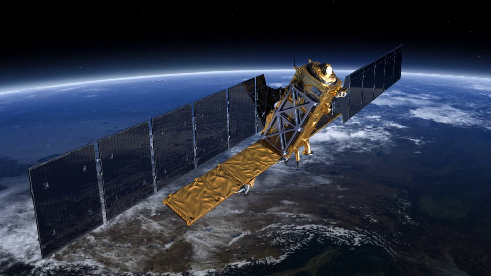

---
title: "Sentinel 1"
author: "Mike Hathorn"
institute: "CASA, UCL"
date: "2023/01/31 (updated: `r Sys.Date()`)"
output:
  xaringan::moon_reader:
    css: xaringan-themer.css
    lib_dir: libs
    nature:
      highlightStyle: github
      highlightLines: true
      countIncrementalSlides: false
---

```{r include=FALSE}
library(RefManageR)
library(knitcitations)
BibOptions(check.entries = FALSE,
           bib.style = "authoryear",
           cite.style = "authoryear",
           style = "markdown",
           hyperlink = TRUE,
           dashed = FALSE,
           no.print.fields=c("doi", "url", "urldate", "issn"))
myBib <- ReadBib("./CASA0023.bib", check = FALSE)

```


```{r xaringan-themer, include=FALSE, warning=FALSE}
library(xaringanthemer)
style_mono_accent(
  base_color = "#1c5253",
  header_font_google = google_font("Josefin Sans"),
  text_font_google   = google_font("Montserrat", "300", "300i"),
  code_font_google   = google_font("Fira Mono")
)
```


# Summary: Sentinel 1

.pull-left[* Two polar-orbiting satellites
* The only Sentinel mission to provide Synthetic Aperture Radar (SAR) imagery
* Allows for day and night imagery regardless of weather
* Focus (land) `r Citep(myBib, "esaLandMonitoringSentinel12022")``: 
  * Forest management
  * Agriculture monitoring
  * Urban deformation mapping
* Also used in marine monitoring and emergency management]

```{r echo=FALSE, out.width= "50%", fig.show='hold', fig.align= 'right', fig.cap= "Sentinel 1P (Source: European Space Agency, 2022)"}


```
---

# Summary 2: Mission Purpose

* Radar mapping of Earth

* Bi-weekly coverage of world's land masses, as well as sea-ice zones, and Europe's coastal zones and shipping routes (daily)

  

  


---

# Summary 3: SAR

* Carries a single C-band SAR instrument
* This allows the satellite to "see through clouds"

## Key attributes:

| **Resolution** |                                               |
| -------------- | --------------------------------------------- |
| Spatial        | As low as 5x5m, 400km swath                   |
| Temporal       | 6 days at equator, 3 days at higher latitudes |
| Radiometric    | 1 dB                                          |

---

# Applications: Maritime monitoring

## CHECK THIS SLIDE

* Used to detect and track objects in the oceans (ships, icebergs)
* Also used for detection of oil spills, which appear darker than water in SAR imagery 
* Near real-time temporal resolution means that it can be used to track and persecute illegal oil spills
* Also used for ice classification and iceberg data by coast guards, navies, and private shipping companies

https://medium.com/geospatial-intelligence/using-sentinel-1-sar-data-for-imagery-intelligence-detection-of-vessels-df8e282ac2c0

[[IMAGE HERE]]

---

# Applications: Land monitoring

* Forestry: Forest type classification, biomass estimation, disturbance detection
* Mapping of fire scars
* Monitoring crop conditions, soil properties, assessing land use, soil degradation
* Can be combined with optical data from other sources to improve the accuracy of informal settlement detection and mapping
  * Needs to be ground-truthed in this context
  * Spatial resolution not always high enough
  * Speckle an issue

https://sentinel.esa.int/web/sentinel/user-guides/sentinel-1-sar/applications/land-monitoring

https://www.mdpi.com/2073-445X/12/1/99

https://www.sciencedirect.com/science/article/pii/S0924271621001635


---

# Applications: Emergency management

* Phase data can be used for interferometric (InSAR) analysis - used for measuring surface deformations caused by seismic events and volcanic activities
* Also used to assess damage after other natural disasters
* High spatial and temporal resolution combined with all-weather imagery is a huge advantage here


---

# Reflections: Strengths

---

# Reflections: Limitations

Wind?

---

# Reflections: Why I chose this

---
# References

---


